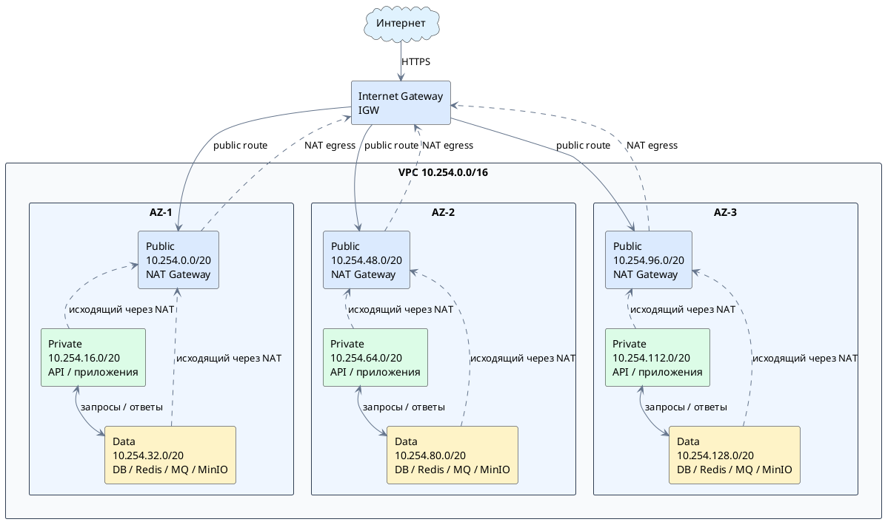

# Выполнение работы

## 1. Обоснование CIDR

Для CIDR выбран диапазон **`10.254.0.0/16`**.

Диапазон `/16` содержит 65 536 IPv4-адресов и оставляет достаточный запас для размещения подсетей в трёх зонах доступности. 

Выбранный диапазон не пересекается с сетями, уже зафиксированными в инфраструктуре `pochini.online`:

- `10.10.0.0/16` — локальная production-сеть;
- `10.42.0.0/16` — Kubernetes Pod network;
- `10.43.0.0/16` — Kubernetes Service network;
- `10.66.0.0/24` и `10.67.0.0/24` — тестовая и production-сети WireGuard;
- `10.253.0.0/16` — Docker-сети stage/dev-инфраструктуры.

## 2. Таблица подсетей

| Зона | Подсеть | CIDR | Тип | Маршрут по умолчанию |
| --- | --- | --- | --- | --- |
| `AZ-1` | публичная | `10.254.0.0/20` | public | IGW |
| `AZ-1` | приватная | `10.254.16.0/20` | private | NAT-GW-az1 |
| `AZ-1` | data | `10.254.32.0/20` | data | NAT-GW-az1 / VPC Endpoint |
| `AZ-2` | публичная | `10.254.48.0/20` | public | IGW |
| `AZ-2` | приватная | `10.254.64.0/20` | private | NAT-GW-az2 |
| `AZ-2` | data | `10.254.80.0/20` | data | NAT-GW-az2 / VPC Endpoint |
| `AZ-3` | публичная | `10.254.96.0/20` | public | IGW |
| `AZ-3` | приватная | `10.254.112.0/20` | private | NAT-GW-az3 |
| `AZ-3` | data | `10.254.128.0/20` | data | NAT-GW-az3 / VPC Endpoint |


Во всех таблицах присутствует системный маршрут `10.254.0.0/16 → local`, обеспечивающий связь между подсетями VPC.

Публичные подсети принимают входящий HTTPS-трафик только на балансировщик. Backend-сервисы и базы данных в них не размещаются.

У приватных подсетей нет маршрута из интернета внутрь: NAT Gateway разрешает только исходящие соединения. Входящие запросы к веб-клиенту и API приходят через балансировщик и правила security groups.

Для data-слоя используются оба механизма:

- **VPC Endpoints** — для S3-совместимых резервных копий, Container Registry, Secrets Manager и системного мониторинга. 
- **NAT Gateway** — резервный и общий исходящий маршрут для обновлений ОС и контейнеров, резервного копирование во внешнее S3-хранилище. 

Прямые входящие соединения из интернета в data-подсети запрещены. При недоступности одной AZ приватные и data-подсети двух других AZ сохраняют собственный путь наружу через свои NAT Gateway, поэтому отказ одного NAT Gateway не блокирует весь сервис.


## 3. Схема сети




## 4. Балансировщики

Для `pochini.online` достаточно двух логических балансировщиков: внешнего ALB для пользовательского трафика и внутреннего ALB для операторской админки. Оба балансировщика разворачиваются с резервом в трёх AZ.

| Сервис | Тип балансировщика | Уровень | Правило / стратегия |
| --- | --- | --- | --- |
| Веб-клиент `pochini.online` | Public ALB | L7 (HTTP/HTTPS) | `pochini.online/*` → target group веб-клиента; Round Robin; health check `GET /` |
| API Gateway и WebSocket | Public ALB | L7 (HTTP/HTTPS) | `api.pochini.online/api/v1/*` и `/api/v1/ws` → API Gateway; Least Connections; health check `GET /api-gateway/ready` |
| Notifier callback | Public ALB | L7 (HTTP/HTTPS) | `callback.pochini.online/notifier/callbacks/sms-prosto/wait-call` → Notifier; Round Robin; health check `GET /notifier/health` |
| MinIO | Public ALB | L7 (HTTP/HTTPS) | `s3.pochini.online/*` → MinIO Service; Least Connections; health check `GET /minio/health/live` |
| Backoffice и Admin | Internal ALB | L7 (HTTP/HTTPS) | `admin.pochini.online` только из WireGuard/VPN: `/` → Backoffice, `/api/v1/*` → Admin; Round Robin для Backoffice и Least Connections для Admin; health check `GET /health` |

Public ALB нужен, потому что фронтенд и API должны быть доступны пользователям из интернета, а правила маршрутизации зависят от host/path и требуют анализа HTTP-запроса.

Internal ALB изолирует `Admin` от общего интернета. Доступ к нему разрешается только из сети WireGuard/VPN, а target group состоит из нескольких реплик Admin, распределённых по AZ.

#### Health check и стратегия распределения

 В target group остаются только реплики, которые отвечают HTTP `200`; при ошибке проверки трафик на реплику не направляется. Базовые параметры: интервал `10 s`, timeout `3 s`, две успешные проверки для возврата в работу и три неуспешные для исключения из группы.

| Балансировщик | Target group | Health check | Стратегия | Обоснование |
| --- | --- | --- | --- | --- |
| Public ALB | Веб-клиент | `GET /` → `200`, порт `3000` | Round Robin | Веб-клиенты stateless, реплики одинаковые, а запросы к статике имеют примерно сопоставимую стоимость |
| Public ALB | API Gateway и WebSocket | `GET /api-gateway/ready` → `200`, порт `8000` | Least Connections | API-запросы имеют разную длительность, а WebSocket-соединения долгоживущие; стратегия уменьшает концентрацию активных соединений на одной реплике |
| Public ALB | Notifier callback | `GET /notifier/health` → `200`, порт `8000` | Round Robin | Callback-запросы короткие и stateless; равномерное распределение не требует учёта состояния сессии |
| Public ALB | MinIO/S3 | `GET /minio/health/live` → `200`, порт `9000` | Least Connections | Загрузка и выдача файлов могут занимать разное время; менее загруженная реплика быстрее принимает новый поток |
| Internal ALB | Backoffice frontend | `GET /health` → `200`, порт `8080` | Round Robin | Веб-интерфейс stateless, все реплики взаимозаменяемы |
| Internal ALB | Admin BFF | `GET /health` → `200`, порт `8000` | Least Connections | Операции модерации имеют разную длительность и могут обращаться к Products/User-ID; запросы лучше распределять по текущей нагрузке |

Для API Gateway и Admin при исключении реплики также включается connection draining: новые соединения на неё не направляются, а активные WebSocket-соединения получают время на корректное завершение. 

Отдельный NLB на текущем этапе избыточен, (если бы успользовался, то был бы L4), так как обычная TCP-проверка подтверждает доступность порта, но не определяет, является ли PostgreSQL основным сервером или репликой и потребовалось бы писать отдельный механизм.

## 5. Связность и резервирование

Для VPC предусматривается один Internet Gateway — IGW, подключённый к VPC. В таблицах маршрутизации всех трёх публичных подсетей задаётся:

```
10.254.0.0/16 → local
0.0.0.0/0    → IGW
```

Приватные и data-подсети используют NAT Gateway своей зоны доступности. Это исключает зависимость исходящего доступа всех трёх зон от одного зонального шлюза. При отказе одной AZ ресурсы двух оставшихся зон сохраняют собственные маршруты в интернет. При использовании единственного NAT Gateway отказ зоны его размещения лишил бы исходящего интернет-доступа ресурсы во всех зависимых от него подсетях.

| Основной путь	| Резервный путь |
| --- | --- |
| Direct Connect через маршрутизатор R1	| Site-to-Site VPN через другой маршрутизатор R2 и независимый интернет-канал |


Механизм переключения — BGP. В штатном режиме маршрутизация предпочитает Direct Connect. После обнаружения отказа и исключения основного маршрута трафик направляется через работающий VPN. 

Для схемы с тремя зональными NAT Gateway можно добавить аварийное переключение на шлюз соседней зоны. В обычном режиме каждая AZ по-прежнему использует собственный NAT.

Например, для rt-private-az1 и rt-data-az1:
```
Штатный режим:
0.0.0.0/0 → NAT-GW-az1
```
При подтверждённой недоступности NAT-GW-az1,
если ресурсы AZ-1 и NAT-GW-az2 продолжают работать:
```
0.0.0.0/0 → NAT-GW-az2
```

## Безопасность

#### Security Groups

| Security Group | Входящие правила | Исходящие правила |
| --- | --- | --- |
| `sg-public-alb` | TCP `443` от `0.0.0.0/0` и `::/0`; TCP `80` от интернета только для перенаправления на HTTPS | TCP `3000` к `sg-web`; TCP `8000` к `sg-api`; TCP `9000` к `sg-minio-ingress`; TCP `8000` к `sg-notifier` |
| `sg-web` | TCP `3000` только от `sg-public-alb` | TCP `443` к разрешённым внешним адресам через NAT, если веб-серверу нужны внешние запросы; остальное запрещено |
| `sg-api` | TCP `8000` только от `sg-public-alb` и разрешённых внутренних сервисов | TCP `5432` к `sg-db`; TCP `6379` к `sg-redis`; TCP `5672` к `sg-rabbitmq`; TCP `8000` к внутренним backend-сервисам; TCP `443` к внешним API через NAT |
| `sg-internal-alb` | TCP `443` только от `10.67.0.0/24` (WireGuard/VPN) | TCP `8080` к `sg-backoffice`; TCP `8000` к `sg-admin` |
| `sg-backoffice` / `sg-admin` | Для Backoffice TCP `8080`, для Admin TCP `8000` — только от `sg-internal-alb` | Backoffice — TCP `443` к разрешённым внешним источникам; Admin — TCP `8000` к Products и User-ID; при необходимости TCP `443` через NAT |
| `sg-db` | TCP `5432` только от `sg-api`; межузловая репликация PostgreSQL — только от `sg-db` в пределах data-подсетей | Только ответы и разрешённый трафик резервного копирования через VPC Endpoint/NAT |
| `sg-redis` / `sg-rabbitmq` | Redis TCP `6379`, RabbitMQ TCP `5672` только от конкретных backend SG; management-порты не открываются из интернета | Только внутренние ответы; резервные и служебные исходящие соединения по отдельному allowlist |
| `sg-minio-ingress` / `sg-minio` | `sg-minio-ingress`: TCP `9000` только от публичного Ingress; `sg-minio`: TCP `9000` только от `sg-minio-ingress`, `sg-media` и доверенных backend SG; консоль `9001` только из VPN | Репликация и резервное копирование — только к разрешённым S3/VPC Endpoint адресам |


#### NAT Gateway

- приватные и data route tables направляют `0.0.0.0/0` только в NAT Gateway своей AZ;
- Security Groups ресурсов разрешают только необходимые исходящие порты, главным образом TCP `443` и явно разрешённые SMTP/SMS-порты;
- Network ACL публичных подсетей разрешает исходящий трафик NAT Gateway и возвратный трафик, но не разрешает произвольные новые входящие соединения;
- NAT Gateway не принимает входящие соединения, инициированные из интернета; ответы возвращаются только для соединений, созданных из private/data-подсетей.

#### VPC Flow Logs

VPC Flow Logs включаются для всей VPC и всех трёх AZ с записью `ACCEPT` и `REJECT`. Логи отправляются в CloudWatch Logs или S3 с ограниченным доступом и политикой хранения.

Запись Flow Logs содержит источник и назначение, порты, протокол, интерфейс/ENI, количество байт и пакетов, время начала и окончания потока, а также решение фильтра. Payload и содержимое запросов в Flow Logs не записываются.

По логам можно обнаружить попытки доступа к endpoint не от разрешённых Security Groups, сканирование портов и повторяющиеся `REJECT` из одного источника, ошибочные маршруты, из-за которых private/data-подсеть теряет доступ через NAT,неожиданные исходящие соединения, утечку данных или компрометацию приложения.

## Контрольные вопросы

> Чем VxLAN отличается от VLAN? Какие ограничения VLAN решает VxLAN?

VxLAN отличается от VLAN  тем, что передает трафик L2 поверх IP-сетей L3 с помощью инкапсуляции в пакеты UDP. VLAN делит физическую сеть на логические сегменты внутри одного пространства, а VxLAN создает виртуальные туннели поверх существующей IP сети.

>  ALB или NLB для gRPC и WebSocket? Аргументируйте через уровень работы балансировщика.

ALB так как работает на L7, как и gRPC и WebSocket

> Что будет с CDN, если не выставить Cache-Control? Почему важно настроить TTL для API?

CDN будет использовать настройки по умолчанию, что может привести к избыточной нагрузке на сервер или к показу устаревших данных пользователям. TTL для API нужно настроить для снижения нагрузки на сервер, ускорения работы приложений и повышения безопасности.

> Сколько NAT Gateway нужно в production на 3 зоны доступности и почему?

3, отказ одного NAT Gateway не блокирует весь сервис, можно переключиться на рабочий.

> Чем Security Group отличается от Network ACL (stateful vs stateless)?

Security Group сохраняет состояние, а Network ACL — работает без сохранения состояния

> Почему нельзя держать базу данных в публичной подсети?

Мы буквально отдадим один из критических компонентов системы хакерам прямо в руки) 

> Зачем нужны VPC Flow Logs и что они позволяют обнаружить?

VPC Flow Logs нужны для сбора и сохранения информации о сетевом трафике. По логам можно обнаружить попытки доступа к endpoint не от разрешённых Security Groups, сканирование портов и повторяющиеся `REJECT` из одного источника, ошибочные маршруты, из-за которых private/data-подсеть теряет доступ через NAT,неожиданные исходящие соединения, утечку данных или компрометацию приложения.