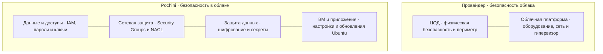

# Лабораторная работа №3 — «Безопасность облачной инфраструктуры»

## Контекст проекта

**Pochini.online** — портал с веб-фронтендом, API, административными сервисами, PostgreSQL и объектным хранилищем. Состав проекта и адреса подсетей взяты из [отчёта по лабораторной работе №1](../lab1/report.md). Работа выполнена по [заданию лабораторной №3](lab.md). Для проекта выбран **Cloud.ru Evolution**. 

## 1.1. Модель Shared Responsibility

В IaaS провайдер отвечает за оборудование и гипервизор. Pochini отвечает за гостевую Ubuntu, приложения, их настройки, доступы и данные.



## 1.2. Ответственность в IaaS, PaaS и SaaS

| Модель | Пример | За что отвечает провайдер | За что отвечает клиент |
|---|---|---|---|
| IaaS | EC2 | Оборудование, сеть, гипервизор | Гостевая ОС, приложения, настройки и данные |
| PaaS | RDS | Инфраструктура, ОС и обслуживание СУБД | Данные, схема БД, пользователи и доступы |
| SaaS | Office 365 | Инфраструктура и работа приложения | Учётные записи, права и данные |

При переходе от IaaS к PaaS и SaaS провайдер обслуживает больше частей системы. Ответственность за свои данные и права доступа клиент сохраняет во всех трёх моделях.

## 1.3. Утечка из-за неправильной Security Group

За ошибку отвечает команда Pochini: правила Security Group настраивает клиент. Провайдер отвечает за облачную инфраструктуру, но не за открытый клиентом доступ к базе данных.

## 2.1. Политика IAM для сервисного аккаунта

Ниже шаблон Bucket Policy для Evolution Object Storage. В лабораторной №1 для хранилища указан VPC Endpoint, но Cloud.ru предлагает его для Advanced, а не Evolution ([описание VPC Endpoint](https://cloud.ru/documents/contracts/terms-of-service/advanced/vpc-endpoint/index)). Поэтому для Evolution в этой схеме выбран выход через SNAT Gateway. В условие `aws:SourceIp` нужно подставить публичные IP шлюзов, которые увидит Object Storage. Значения в угловых скобках — заменяемые примеры, а не готовые адреса. 
```json
{
  "Version": "2012-10-17",
  "Statement": [
    {
      "Sid": "AllowReadAndUploadFromPochiniSnatAddresses",
      "Effect": "Allow",
      "Principal": {
        "AWS": "arn:aws:iam::<TENANT_ID>:service_account/<SERVICE_ACCOUNT_ID>"
      },
      "Action": [
        "s3:GetObject",
        "s3:PutObject"
      ],
      "Resource": "arn:aws:s3:::my-backup-bucket/*"
    },
    {
      "Sid": "DenyReadAndUploadOutsidePochiniSnatAddresses",
      "Effect": "Deny",
      "Principal": {
        "AWS": "arn:aws:iam::<TENANT_ID>:service_account/<SERVICE_ACCOUNT_ID>"
      },
      "Action": [
        "s3:GetObject",
        "s3:PutObject"
      ],
      "Resource": "arn:aws:s3:::my-backup-bucket/*",
      "Condition": {
        "NotIpAddress": {
          "aws:SourceIp": [
            "<SNAT_PUBLIC_IP_AZ_1>/32",
            "<SNAT_PUBLIC_IP_AZ_2>/32",
            "<SNAT_PUBLIC_IP_AZ_3>/32"
          ]
        }
      }
    },
    {
      "Sid": "DenyObjectDeletion",
      "Effect": "Deny",
      "Principal": {
        "AWS": "arn:aws:iam::<TENANT_ID>:service_account/<SERVICE_ACCOUNT_ID>"
      },
      "Action": [
        "s3:DeleteObject",
        "s3:DeleteObjectVersion"
      ],
      "Resource": "arn:aws:s3:::my-backup-bucket/*"
    }
  ]
}
```

Сервисному аккаунту назначается роль только с правами `GetObject` и `PutObject`. Не следует выдавать ему `s3e.admin` или роль «Администратор проекта»: при наличии права `s3e.tenant.edit` Cloud.ru не проверяет Bucket Policy. Это ограничение описано в [документации провайдера](https://cloud.ru/docs/s3e/ug/topics/security__bucketpolicy).

## 2.2. Сущности IAM

| Сущность | Кто это | Как подтверждает личность |
|---|---|---|
| Пользователь | Учётная запись человека | Паролем; при включённой настройке — также через MFA. Для программного доступа могут применяться ключи |
| Сервисный аккаунт | Учётная запись приложения или автоматизации | Ключами или временными данными доступа, полученными через роль |
| Роль | Набор прав, который пользователь или сервис может временно принять | После принятия роли субъект получает временные данные доступа |

## 2.3. Минимальные привилегии

Учётной записи нужно выдавать только те действия и доступ к тем ресурсам, которые нужны для её задачи. Например, CI-серверу, который загружает файлы в S3, достаточно `s3:PutObject` на нужный бакет или его префикс. Права `s3:*`, администратора и удаление файлов для этой задачи избыточны.

## 2.4. Частые ошибки IAM

| Ошибка | Чем опасна | Как её избежать |
|---|---|---|
| Слишком широкие права на запуск ресурсов | Можно запустить лишние или небезопасно настроенные ресурсы и увеличить расходы | Разрешать запуск только нужных типов ресурсов и только в нужных проектах |
| Слишком долгий срок временного доступа | Старые учётные данные могут остаться пригодными после завершения задачи | Использовать короткий срок действия и отзывать доступ после работы |
| Постоянные права администратора или root | Ошибка или взлом такой учётной записи даёт широкий контроль над облаком | Выдавать административные права только на время конкретной задачи |
| Общая учётная запись на нескольких людей | Нельзя точно установить, кто выполнил действие | Создавать личные учётные записи и вести аудит действий |
| `*` в действиях или ресурсах | Политика может дать больше прав, чем нужно | Указывать только нужные действия и ресурсы |

## 3.1. Vault и AWS Secrets Manager

| Критерий | HashiCorp Vault | AWS Secrets Manager |
|---|---|---|
| Где работает | Можно развернуть в разных облаках или в собственной инфраструктуре | Управляемый сервис AWS |
| Динамические секреты и TTL | Может выдавать временные учётные данные с ограниченным сроком и отзывать их | Подходит для хранения и ротации секретов; возможности динамической выдачи уже |
| Ротация | Можно настроить обновление статических секретов и выдачу новых динамических | Поддерживает автоматическую ротацию; способ зависит от типа секрета и интеграции |
| Обслуживание | При самостоятельном размещении нужно обслуживать серверы, обновления, доступность и unseal | Серверную часть обслуживает AWS |
| Стоимость | Учитываются инфраструктура, обслуживание и, для отдельных редакций, лицензия | Зависит от числа секретов и запросов; точную цену нужно смотреть в актуальном тарифе |
| Связь с IAM | Есть способы входа через AWS IAM; доступ к секретам дополнительно задают политики Vault | Доступ задают политики AWS IAM |

Для стека только на AWS выбран AWS Secrets Manager: он управляется AWS и интегрирован с сервисами AWS. Для мультиоблачной среды выбран Vault: его можно развернуть отдельно от конкретного облака и использовать как общее хранилище секретов. При самостоятельном размещении Vault команда сама отвечает за его обслуживание. Цены в отчёте не приводятся: их нужно сравнивать по актуальным тарифам и с учётом затрат на обслуживание.

## 3.2. Правила работы с секретами

- Не хранить секреты в исходном коде и Git; получать их из менеджера секретов во время работы приложения.
- Давать доступ к секретам только нужным пользователям и сервисам, записывать обращения в аудит.
- Защищать соединение с менеджером секретов с помощью TLS; держать Vault в закрытой сети.
- Регулярно менять секреты, а при утечке сразу заменять их.
- Не записывать секреты в логи; скрывать чувствительные значения и проверять логи на случайные утечки.

## 3.3. Пароль прод-базы попал в открытый репозиторий

1. Сразу сменить пароль базы: опубликованный пароль следует считать украденным.
2. Обновить пароль во всех сервисах, которые подключаются к базе, и проверить их работу.
3. Проверить журналы базы и облачных сервисов на подозрительные подключения и действия.
4. Удалить секрет из текущих файлов и, если возможно, из истории Git. Это не заменяет смену пароля: копии репозитория могли сохраниться.
5. Положить новый пароль в менеджер секретов и ограничить к нему доступ.
6. Проверить репозиторий и логи на другие секреты; добавить проверку секретов в CI.

## 4.1. Шифрование in-transit и at-rest

**In-transit** — данные шифруются во время передачи. Это затрудняет их перехват или подмену в сети. Примеры: HTTPS между браузером и сайтом и TLS между API и PostgreSQL.

**At-rest** — данные шифруются во время хранения. Это помогает защитить содержимое диска, его копии или файлов в хранилище. Примеры: том данных PostgreSQL с LUKS и объекты в Object Storage с SSE-KMS.

## 4.2. Envelope encryption в KMS

Обычно KMS создаёт Data Key в открытом и зашифрованном виде. Приложение шифрует данные открытым Data Key, удаляет его из памяти и хранит зашифрованную копию рядом с данными. Для чтения KMS расшифровывает Data Key после проверки прав; сам мастер-ключ (CMK) приложению не выдаётся и остаётся внутри KMS. Документация Cloud.ru Evolution описывает шифрование, расшифрование и ротацию ключей, но не подтверждает отдельную операцию создания Data Key или использование HSM. Поэтому в проекте приложение создаёт случайный Data Key и передаёт его в Key Management для шифрования ([быстрый старт](https://cloud.ru/docs/kms/ug/topics/quickstart), [описание ключей](https://cloud.ru/docs/kms/ug/topics/concepts__service-essence)).

## 4.3. Шифрование в проекте

| Что защищаем | Как защищаем | Сервис или компонент |
|---|---|---|
| Трафик между клиентом, API и базой | TLS 1.2/1.3. Так как Evolution Load Balancer работает на L4, TLS завершается на программном reverse proxy; DNS используется только для имён | Evolution Load Balancer, reverse proxy, Evolution DNS, PostgreSQL |
| Диск с данными PostgreSQL | Шифруем том средствами Ubuntu с помощью LUKS; ключ храним в зашифрованном виде через Key Management | Ubuntu/LUKS и Evolution Key Management |
| Объекты S3 | SSE-KMS | Evolution Object Storage и Key Management |
| База данных | Файлы PostgreSQL лежат на зашифрованном томе; соединение с API защищено TLS | PostgreSQL на ВМ и LUKS |
| Резервные копии | Шифруем объекты в хранилище через SSE-KMS | Evolution Object Storage и Key Management |

Cloud.ru документирует SSE-KMS для [Object Storage](https://cloud.ru/docs/s3e/ug/topics/concepts__encryption-sse-kms). Документация по [шифрованию дисков](https://cloud.ru/docs/evs/ug/topics/guides__disk-encryption) относится к Elastic Volume Service и не подтверждает такую же функцию для дисков Evolution. Поэтому для PostgreSQL выбран LUKS внутри Ubuntu. Получение ключа из Key Management и автоматическую разблокировку тома нужно отдельно реализовать и проверить. 

## 4.4. Ошибки при шифровании

| Ошибка | Чем опасна |
|---|---|
| Нет TLS или настроен устаревший TLS | Трафик можно перехватить или подменить |
| Данные на диске или в хранилище не зашифрованы | Получив копию носителя или файла, можно прочитать данные |
| Ключ лежит рядом с данными или в коде | Злоумышленник может получить и данные, и ключ к ним |
| Ключи долго не меняются | Украденный ключ может долго оставаться пригодным |

## 5.1. Security Group и Network ACL

| Свойство | Security Group | Network ACL |
|---|---|---|
| Где работает | На ресурсе или сетевом интерфейсе ВМ | На уровне подсети |
| Состояние соединения | Stateful: ответный трафик разрешается автоматически | Stateless: входящий и ответный исходящий трафик проверяются отдельно |
| Правила | Только разрешающие | Разрешающие и запрещающие |
| Порядок проверки | Приоритеты не задаются | Проверяются по приоритету, от меньшего номера к большему |

Это общая модель из задания. В Cloud.ru Evolution документированы Security Groups на уровне ресурсов. Фильтрация на уровне виртуальной сети указана как запланированная, а встроенный WAF не заявлен. Поэтому NACL и WAF в схеме ниже — проектные уровни защиты; при реализации для них нужно отдельное решение, например внешний WAF и межсетевой экран. См. [сравнение платформ Cloud.ru](https://cloud.ru/docs/evolution/overview/topics/platforms-comparison) и [сравнение SG и NACL](https://cloud.ru/docs/vpc/ug/topics/concepts__network-acl-security-group).

## 5.2. Путь трафика через уровни защиты

```mermaid
flowchart LR
    client["Клиент"] --> waf["Внешний или программный WAF · L7"]
    waf --> network_filter["NACL / внешний сетевой экран · подсеть"]
    network_filter --> lb["Evolution Load Balancer · L4 · TCP/443"]
    lb --> proxy_sg["Security Group на ВМ reverse proxy"]
    proxy_sg --> proxy["Reverse proxy · TLS и HTTP-маршрутизация"]
    proxy --> backend_sg["Security Group backend"]
    backend_sg --> app["Приложение"]
```



Это схема проекта, а не список готовых сервисов Evolution: WAF и сетевой экран нужно будет выбрать отдельно.

## 5.3. Правила доступа для веб-входа и ВМ

| Направление / фильтр | Протокол | Порт | Источник | Куда |
|---|---|---:|---|---|
| Вход на внешний WAF | TCP | 443 | `0.0.0.0/0` | Публичная HTTPS-точка входа |
| Вход на публичный Load Balancer | TCP | 443 | Только адреса внешнего WAF | L4-балансировщик; прямой доступ в обход WAF закрыт |
| Security Group reverse proxy | TCP | 443 | Приватные IP балансировщика | Reverse proxy на ВМ; здесь завершается TLS |
| Security Group backend | TCP | 3000, 8000 | Только Security Group reverse proxy в той же зоне | Web и API на ВМ |
| Security Group административной ВМ | TCP | 22 | `10.67.0.0/24` | SSH из WireGuard/VPN проекта |

В Evolution Security Group назначается сетевому интерфейсу ВМ. Публичный TCP/443 настраивается на Load Balancer, а не в Security Group. Балансировщик передаёт запросы с приватных IP своих ресурсных единиц, поэтому эти адреса нужно разрешить для reverse proxy и узнать после создания балансировщика ([документация Load Balancer](https://cloud.ru/docs/nlb/ug/topics/concepts__service-essence)). Адреса WAF тоже нужно будет подставить после выбора решения. Группы безопасности привязаны к зонам доступности, поэтому правила backend задаются для соответствующей зоны ([документация Security Groups](https://cloud.ru/docs/security-groups/ug/topics/guides__add-sg-rule)). Для проекта использован VPN-диапазон `10.67.0.0/24` из лабораторной №1. Диапазон `10.0.1.0/24` из условия — только пример.

## 5.4. От каких атак защищает WAF

WAF проверяет веб-запросы и может блокировать, например:

- **SQL-инъекцию:** попытку внедрить команды для базы данных в параметры запроса.
- **XSS:** попытку запустить внедрённый скрипт в браузере пользователя.
- **Path traversal:** попытку обратиться к файлам за пределами разрешённой папки.

Security Group проверяет источник, протокол и порт соединения. Она может пропустить HTTPS на TCP/443, но не проверяет путь или содержание HTTP-запроса. Для этого нужен WAF.

## Сводная таблица сетевой защиты

| Компонент | Размещение из лабораторной №1 | Фильтры | Stateful / Stateless | Правило | Что защищаем |
|---|---|---|---|---|---|
| Публичный веб-вход | LB в public-подсетях `10.254.0.0/20`, `10.254.48.0/20`, `10.254.96.0/20`; reverse proxy и backend в private-подсетях `10.254.16.0/20`, `10.254.64.0/20`, `10.254.112.0/20` | L4 LB, Security Groups; отдельные WAF и сетевой экран при внедрении | SG: stateful; WAF: L7; сетевой экран: по выбранной реализации | TCP/443 к публичному входу; TCP/3000 и TCP/8000 к backend только от reverse proxy | Веб-клиент и API |
| Backoffice и Admin | Внутренний L4 LB, reverse proxy в private-подсетях; VPN `10.67.0.0/24` | Security Groups | Stateful | HTTPS-вход только из VPN; сервисы принимают трафик от reverse proxy | Операторский интерфейс и Admin API |
| PostgreSQL | Data-подсети `10.254.32.0/20`, `10.254.80.0/20`, `10.254.128.0/20` | Security Group; сетевой экран как отдельное решение | SG: stateful; экран: по реализации | TCP/5432 только от API; вход из интернета закрыт | Каталог, заказы и чаты |
| Вся VPC | `10.254.0.0/16`, public/private/data-подсети | Гостевой или отдельный сетевой экран | По выбранному экрану | Разрешать только нужные потоки | Сетевой периметр |
| Веб-приложение | WAF перед публичным входом | Внешний или программный WAF | L7 | Блокировать SQLi, XSS и path traversal | Приложение и API |

## Выводы

В этой работе я разобрался, за какие части облака отвечают провайдер и клиент, как ограничивать права сервисных аккаунтов и где хранить секреты. Также рассмотрел шифрование данных и сетевые правила. Для Cloud.ru Evolution часть нужных уровней защиты придётся проектировать отдельно: встроенные NACL и WAF в отчёте не предполагаются, а реальные ресурсы не создавались.
