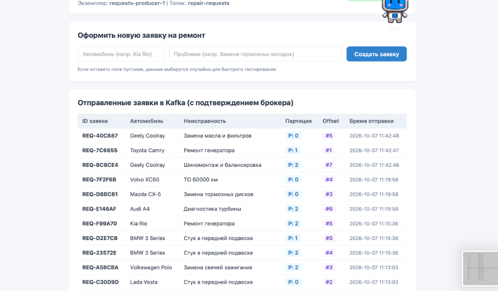
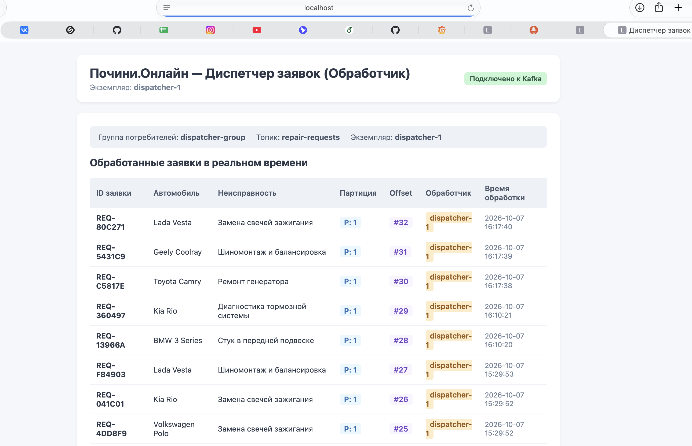
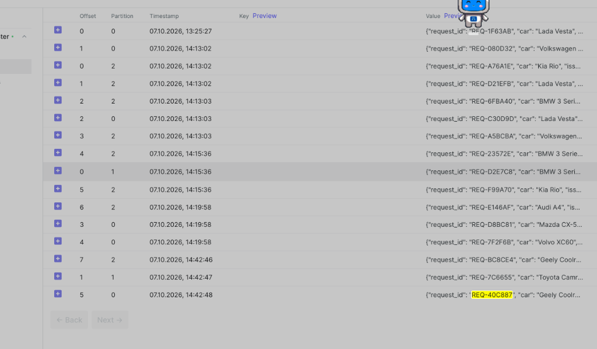
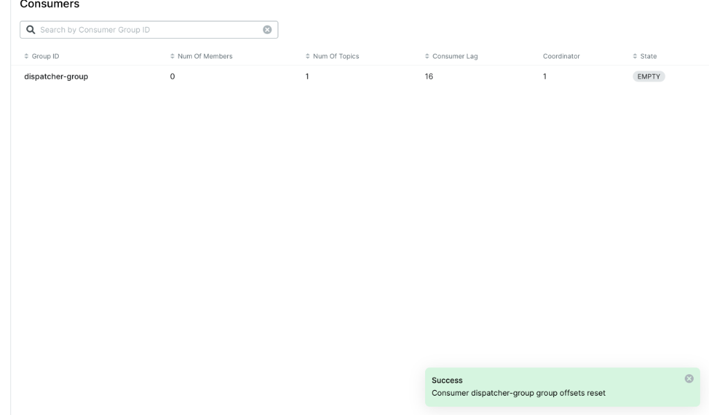
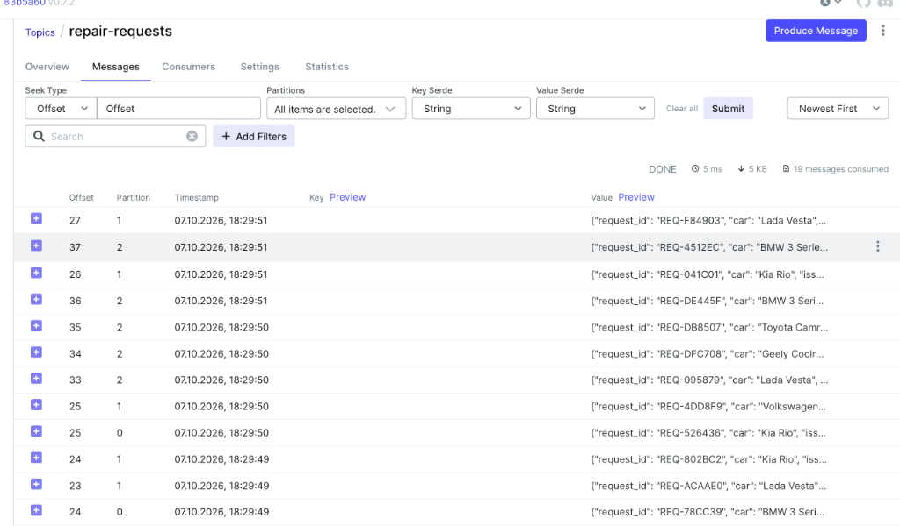
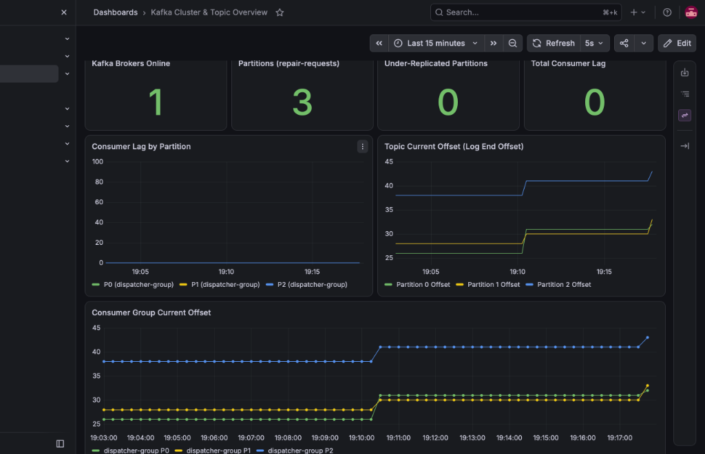

# Лабораторная работа 4 — Kafka для двух сервисов: настройка с нуля

## 1. Архитектура и предметная область

В качестве предметной области выбрана платформа поиска автосервисов и организации ремонта **«Почини.Онлайн»** (из Лабы 1). Но так как в оригинальной архитектуре используется rabbitmq, для лабы сервисы были сгенерированы.

В архитектуре выделены два сервиса, взаимодействующие через брокер сообщений **Apache Kafka**:
1. **Издатель (`requests-service`)** — принимает запросы от пользователей на создание заявки на ремонт (`repair-requests`) через веб-интерфейс, формирует событие с уникальным идентификатором `request_id`, маркой машины и описанием неисправности и отправляет его в Kafka. Веб-страница наглядно отображает полученные от брокера метаданные: партицию и `offset`.
2. **Обработчик (`dispatcher-service`)** — читает события из топика в составе консьюмер-группы `dispatcher-group`, имитирует обработку заявки (назначение подходящего автосервиса, расчёт времени) с настраиваемой задержкой и фиксирует факт обработки с указанием имени инстанса (`INSTANCE_NAME`), партиции и `offset`.

### Конфигурация через переменные окружения

| Переменная | Назначение | Значение по умолчанию |
|------------|------------|-----------------------|
| `KAFKA_BOOTSTRAP_SERVERS` | Адрес брокера Kafka | `kafka:9092` |
| `KAFKA_TOPIC` | Имя целевого топика | `repair-requests` |
| `KAFKA_GROUP_ID` | Имя группы потребителей | `dispatcher-group` |
| `INSTANCE_NAME` | Идентификатор экземпляра сервиса | `requests-producer-1` / `dispatcher-1` |
| `PORT` | Порт веб-сервера | `8001` (producer) / `8002` (consumer) |
| `PROCESSING_DELAY` | Имитация длительности обработки (сек) | `0.8` |

Оба сервиса снабжены изолированными `Dockerfile` на базе легковесного образа `python:3.11-slim` и используют библиотеку `aiokafka`.


## 2. Развертывание инфраструктуры 

Развертывание выполнено на уровне **Docker Compose** командой
`docker compose up`.

Интерфейсы доступны по адресам:
- Издатель заявок: `http://localhost:8001`
- Обработчик заявок: `http://localhost:8002`





## 3. Бизнес-ситуации через конфигурацию 

### Ситуация 1. Подготовка к распродаже и попытка уменьшения партиций

- **Проблема:** Ожидается всплеск заявок на техобслуживание в сезон смены резины и подготовки к зиме. Требуется распараллелить вычитку между несколькими экземплярами диспетчеров.
- **Действие в конфигурации:** В `docker-compose.yml` в блоке сервиса `topic-init` увеличено количество партиций:
  ```yaml
  PARTITIONS: 3
  ```
  После применения `docker compose up topic-init` топик расширен до 3 партиций (`PartitionCount: 3`).
- **Попытка уменьшения партиций обратно до 1:** При возврате `PARTITIONS: 1` в конфиге брокер выдал ошибку:
  ```text
  InvalidPartitionsException: The topic repair-requests currently has 3 partition(s); 1 would not be an increase.
  ```
  Это происходит, так как Kafka организована как неизменяемый последовательный журнал на диске (*append-only commit log*). Сообщения упорядочены внутри каждой партиции, а распределение по партициям опирается на хэш ключа: $\text{partition} = \text{hash}(key) \pmod N$.
  Уменьшение числа партиций разрушило бы строгий порядок сообщений (*ordering*), сломало бы адресацию по смещениям (*offset*), привело бы к коллизиям ключей и потребовало бы сложного перемещения и слияния файлов сегментов данных на диске. Поэтому Kafka принципиально запрещает уменьшение партиций «на лету». Единственный способ уменьшить число партиций - завести новый топик и перенаправить поток сообщений.


### Ситуация 2. Добавление второго сборщика/обработчика

- **Действие в конфигурации:** В `docker-compose.yml` описан второй экземпляр сервиса `consumer-2`:
  ```yaml
  consumer-2:
    build: ./consumer
    container_name: dispatcher-consumer-2
    ports:
      - "8003:8003"
    environment:
      KAFKA_BOOTSTRAP_SERVERS: kafka:9092
      KAFKA_TOPIC: repair-requests
      KAFKA_GROUP_ID: dispatcher-group
      INSTANCE_NAME: dispatcher-2
      PORT: 8003
  ```
- **Наблюдение:**
  После старта `consumer-2` сработал механизм **Consumer Group Rebalance**. Координатор группы распределил партиции:
  - `dispatcher-1` стал читать партиции `{0, 2}`
  - `dispatcher-2` стал читать партицию `{1}`
  Поступающие заявки начали обрабатываться параллельно двумя независимыми процессами.
- **Контрольный вопрос:** *Что произойдёт, если сборщиков станет больше, чем партиций (например, 4 или 5 сборщиков на 3 партиции)?*
  **Ответ:** Внутри одной группы консьюмеров действует фундаментальное правило: **одна партиция не может читаться более чем одним консьюмером одновременно**. Лишние сборщики перейдут в состояние холодного простоя (**IDLE / Standby**). Они будут поддерживать соединение и heartbeat с координатором, но не получат ни одного сообщения, пока один из активных инстансов не упадет.


### Ситуация 3. Отказ обработчика во время деплоя

- **Действие:**
  Оба обработчика были остановлены:
  ```bash
  docker compose stop consumer-1 consumer-2
  ```
  После этого через веб-интерфейс издателя отправлено несколько заявок (`Audi A4`, `Mazda CX-5`, `Volvo XC60`).
- **Как убедиться, что заявки не потеряны:**
  Продюсер получил синхронный ответ от брокера с присвоенными `partition` и `offset`. Сообщения надежно записаны в журнал на диске Kafka.
  Через `kafka-consumer-groups.sh` зафиксировано образование отставания (**LAG = 3**): `LOG-END-OFFSET` увеличился, а `CURRENT-OFFSET` остался на прежнем уровне.
- **Восстановление:**
  После запуска контейнеров (`docker compose start consumer-1 consumer-2`) консьюмеры обратились к координатору группы, получили свои назначенные партиции и последние закоммиченные offset'ы, вычитали все накопившиеся за время простоя заявки и свели **LAG к 0**.
  Это иллюстрирует свойство **Decoupling (слабая связность)**: брокер сохраняет сообщения независимо от доступности потребителей.

---

## 4. Веб-интерфейс Kafka UI 

В `docker-compose.yml` подключен сервис `kafka-ui` (`provectuslabs/kafka-ui:v0.7.2`) на порту `8080`:
```yaml
  kafka-ui:
    image: provectuslabs/kafka-ui:v0.7.2
    container_name: kafka-ui
    ports:
      - "8080:8080"
    environment:
      KAFKA_CLUSTERS_0_NAME: pochini-cluster
      KAFKA_CLUSTERS_0_BOOTSTRAPSERVERS: kafka:9092
```
Интерфейс доступен по адресу `http://localhost:8080`.


## 5. Бизнес-ситуации через Kafka UI 

### Ситуация 4. Разбор жалобы на конкретный заказ
- Создана заявка `REQ-40C887` (скрин есть во второй части отчета).
- В Kafka UI в топике `repair-requests` во вкладке **Messages** найдено сообщение:

- Во вкладке **Consumers** проверен статус группы `dispatcher-group`: текущий offset группы на партиции `0` превышает offset сообщения, лаг равен 0, что подтверждает успешную обработку заявки сборщиком.


### Ситуация 5. Пересчёт истории для аналитики (Reset Offsets)
- Для повторной аналитической обработки всех когда-либо поступивших заявок в Kafka UI выполнен сброс смещений группы `dispatcher-group`:
  1. Сервисы обработки временно остановлены для перевода группы в статус `Empty`.
  2. В UI группы был выполнен **Reset offset** топика `repair-requests` режим **Earliest**.
  3. Лаг моментально вырос до общего числа сообщений (16).
  4. После запуска обработчики заново вычитали все 16 заявок с самого начала лога.



- **Почему в Kafka это возможно, а в RabbitMQ нет:**
  В традиционных брокерах очередей (RabbitMQ, AWS SQS) чтение является деструктивным (*destructive read*): как только потребитель обрабатывает и подтверждает сообщение (ACK), оно удаляется из очереди.
  В Kafka чтение **недеструктивное**. Сообщения сохраняются в неизменяемом логе до истечения политики хранения (*retention*), а `offset` консьюмер-группы — это просто числовой курсор-указатель в метаданных. Сброс смещения перемещает курсор в начало, позволяя повторно воспроизвести всю историю.

### Ситуация 6. Заполнение диска и политика Retention
- Для экономии дискового пространства в настройках топика через Kafka UI изменен параметр:
  - `retention.ms = 10000` (10 секунд);
- В Kafka очистка происходит на уровне сегментов: активный сегмент не подлежит удалению, пока не закроется. После ротации сегмента и истечения 10 секунд фоновый поток очистки (*cleaner thread*) удалил старые сегменты.
- В Kafka UI зафиксировано, что минимальный доступный offset топика (*earliest*) сместился на `21-24`, а сообщения с оффсетами от `0` до `20` безвозвратно удалились с диска брокера.



## 6. Мониторинг Kafka 

### Стек мониторинга

1. **`kafka-exporter`** (`danielqsj/kafka-exporter:v1.10.0`, порт `9308`) — подключается к брокеру по протоколу Kafka и экспортирует метрики состояния кластера, топиков, партиций и потребительских групп в формате Prometheus.
2. **`prometheus`** (`prom/prometheus:v3.15.0`, порт `9090`) — опрашивает `kafka-exporter` с интервалом 5 секунд.
3. **`grafana`** (`grafana/grafana:13.2.3`, порт `3000`, логин/пароль: `admin/admin`) — автоматически провижинит источник данных Prometheus и дашборд `Kafka Cluster & Topic Overview`.

### Метрики на дашборде
- **Kafka Brokers Online** (`kafka_brokers`) — количество активных брокеров в кластере.
- **Partitions Count** (`kafka_topic_partitions{topic="repair-requests"}`) — текущее число партиций топика.
- **Under-Replicated Partitions** (`sum(kafka_topic_partition_under_replicated_partition)`) — количество проблемных партиций с отстающими репликами.
- **Consumer Group Lag** (`sum(kafka_consumergroup_lag{topic="repair-requests"})`) — суммарный лаг группы потребителей.
- **Lag by Partition** (`kafka_consumergroup_lag{topic="repair-requests"}`) — детализация отставания по каждой партиции.
- **Topic Current Offset vs Consumer Group Current Offset** — сравнение темпа записи издателем и темпа вычитки обработчиком.



---

### Обоснование 3 ключевых метрик для алертов

#### 1. Consumer Group Lag (`kafka_consumergroup_lag > Threshold`)
- **Что ловит:** Обработчики заявок не успевают справляться с входящим потоком событий, либо инстансы обработчика зависли/упали в аварийный цикл (*CrashLoop*).
- **Чем грозит бизнесу:** Нарушение SLA сервиса — клиенты не получают подтверждение ремонта, заявки висят в очереди. При дальнейшем росте лага и истечении `retention.ms` непрочитанные заявки будут безвозвратно удалены брокером, что приведет к прямым финансовым и репутационным потерям.

#### 2. Under-Replicated / Offline Partitions (`kafka_topic_partition_under_replicated_partition > 0`)
- **Что ловит:** Нарушение синхронизации реплик (ISR — In-Sync Replicas), отказ брокера или проблемы сетевой связности между нодами кластера.
- **Чем грозит бизнесу:** Потеря отказоустойчивости. При отказе текущего брокера-лидера партиция полностью перестанет принимать новые записи и отдавать данные читателям (*Downtime*), а в худшем случае произойдет потеря подтвержденных транзакций (*Data Loss*).

#### 3. Использование диска брокера (`DiskSpaceUtilization > 85%`)
- **Что ловит:** Быстрое заполнение дискового раздела с логами сообщений брокера из-за аномального трафика, слишком большого `retention.bytes` или сбоя фоновой очистки сегментов.
- **Чем грозит бизнесу:** При заполнении диска до 100% брокер Kafka аварийно завершает работу (*read-only / panic shut down*). Кластер полностью блокирует прием любых новых сообщений от всех сервисов платформы.

